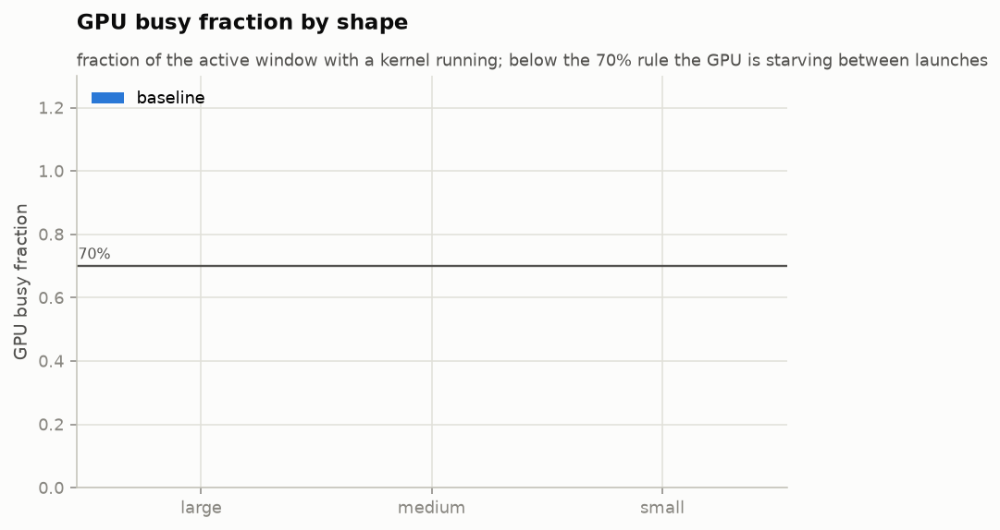

# Optimizing a Transformer forward pass for one GPU

**TikTok TechJam 2026 — Problem 3: Implement a GPU Kernel for a Transformer Layer**

> **Status: draft.** Everything that follows from the problem definition, the
> reference implementation or our methodology is final. Slots marked
> `<FILL A: …>` need a number from the GPU machine; `<FILL B: …>` are filled
> from `results/summary.md` once the sweep has run. Run
> `python docs/check_ready.py` to list what is still outstanding.

---

## 1. What the problem actually is

The organizers supply a fixed Transformer and a correct-but-slow reference
implementation of its forward pass. Exactly one method may be replaced —
`UserOptimizedTransformer.forward()`. Everything else, including the code that
grades the result, stays theirs and untouched.

Two constraints define the whole exercise:

**The correctness oracle is elementwise and unforgiving.** Every output element
must satisfy

```
abs(user − ref) <= atol   OR   abs(user − ref) <= rtol · abs(ref)
```

It is an OR, not an AND, and it is per element, not an aggregate — a single bad
element fails the run no matter how good the mean error is. We target the
stricter of the two published tolerance pairs: the torch script's own defaults
`atol = 0.001, rtol = 0.01`, not the problem statement's `0.002 / 0.02`.

**The score is a ratio of medians**, `baseline_median_ms / optimized_median_ms`,
measured on the same machine in the same process. That makes the *measurement
apparatus* part of the deliverable: a speedup that moves when the room warms up
is not a result. Section 8 is about what we did to make the number stable.

### 1.1 Why attention is quadratic, and what that costs

The quadratic term is not intrinsic to attention. Writing it out:

```
Attention(Q, K, V) = softmax(QKᵀ / √d_k) · V
```

Without the softmax, this is a product of three matrices, and matrix
multiplication is associative: `(QKᵀ)V` costs `O(S²·d)` but `Q(KᵀV)` costs
`O(S·d²)` — linear in sequence length. **The softmax is the only reason the
regrouping is illegal.** It is a nonlinearity sitting between `QKᵀ` and `V`, so
the `S × S` matrix must exist before `V` can be applied.

That is why every serious attention optimization is an argument about the
softmax: not removing it, but avoiding *materializing* the matrix it operates
on. Flash-attention-style kernels compute the softmax in tiles with a running
maximum and a running normalizer, so the `S × S` matrix exists only in registers
and shared memory, never in HBM.

The reference implementation materializes it explicitly — and, for numerical
stability, in fp32 even when the model runs in fp16 or bf16. So each score
element costs 2 bytes of scores plus 8 bytes of fp32 softmax intermediates, and
the traffic is `B·H·S²` elements written and re-read roughly three times per
layer. This is the term that decides everything downstream:

| S | analytic FLOPs | est. peak memory | arithmetic intensity, explicit | arithmetic intensity, fused |
|---|---|---|---|---|
| 512 | 180 GFLOP | 0.53 GiB | 64.6 FLOP/byte | 113.8 FLOP/byte |
| 1024 | 412 GFLOP | 1.42 GiB | 52.0 FLOP/byte | 133.2 FLOP/byte |
| 2048 | 1031 GFLOP | 4.70 GiB | 40.5 FLOP/byte | 168.6 FLOP/byte |
| 4096 | 2886 GFLOP | 17.27 GiB | 32.3 FLOP/byte | 237.4 FLOP/byte |

_(B=8, d=512, H=8, L=6, fp32. FLOPs and bytes from `analysis/roofline.py`;
memory from `src/memcheck.py`. Derivations in §6.)_

The two intensity columns move in **opposite directions**. As the sequence
grows, the explicit implementation reads and writes more bytes per FLOP and
slides *down* toward the bandwidth-bound region; a fused implementation does the
same arithmetic while moving less memory and climbs *away* from it. With this
card's fp32 ridge at 62.5 FLOP/byte (§6), the baseline crosses from
compute-bound into bandwidth-bound somewhere around S = 1024 — and that crossing
is where a fused kernel should start winning by a lot rather than a little. The
measured speedup curve in §4 either shows that shape or contradicts it, and both
outcomes are informative.

### 1.2 Three bottlenecks, three different fixes

Optimizing the wrong one wastes a day, so the first thing we measured was which
one we had.

| Bottleneck | Symptom | How we diagnose it | What actually helps |
|---|---|---|---|
| **Launch overhead** | GPU idle between kernels; runtime barely responds to shape | GPU busy % from a profiler trace (§3) | Fewer, larger kernels: fusion, CUDA graphs. A faster kernel changes almost nothing. |
| **Memory bandwidth** | Arithmetic intensity left of the ridge; time scales with bytes moved, not FLOPs | Roofline position (§6) | Stop moving the same bytes: fuse, avoid materializing intermediates, use a smaller dtype. |
| **Compute** | Near peak for the dtype; right of the ridge | Achieved TFLOP/s vs peak (§6) | Better math or better tensor-core utilization. Everything else is noise. |

---

## 2. Environment

| | |
|---|---|
| CPU | `<FILL A: model, cores>` |
| GPU | `<FILL A: model>` — compute capability `<FILL A: sm_XX>` |
| VRAM | `<FILL A: GB>` |
| Driver / CUDA | `<FILL A: driver version, CUDA version>` |
| OS | `<FILL A: WSL2 version, distro>` |
| PyTorch | `<FILL A: version and build (cu124?)>` |
| Triton | `<FILL A: version, or "not used">` |
| Disk | `<FILL A: type>` |

Peak figures used for the roofline in §6:

| | value | source |
|---|---|---|
| fp32 peak | `<FILL A: TFLOP/s>` (placeholder 12.0) | spec sheet |
| bf16 tensor-core peak | `<FILL A: TFLOP/s>` (placeholder 48.0) | spec sheet |
| memory bandwidth | `<FILL A: GB/s>` (placeholder 192) | spec sheet |

Every ridge point in this report scales directly with these three numbers, so
they are stated rather than assumed.

A second machine — macOS on Apple Silicon, CPU only — runs the correctness
suite, the analysis and every figure. Nothing in this report's *measurements*
comes from it; it exists so that correctness is verified somewhere other than
the machine that is also being optimized.

### 2.1 Provenance

The organizers' benchmark file is byte-identical to the download:

```
SHA-256  1bd12523657f338c09b53f0bb9052d9d16f728a71bd22bc8298567e1a4d78c22
```

A test asserts this on every run. We import from that file rather than copying
out of it, so our accuracy and timing numbers come from the organizers' own
functions — `generate_random_case`, `compare_outputs`, `warmup_model`,
`benchmark_once` — with their seed scheme and their alternating round order.
Global state (`manual_seed`, matmul precision, the TF32 flags) is set exactly as
their `main()` sets it, because all three change the result.

Every row in `results/results.csv` carries the `git_sha` it was produced at, and
the harness refuses to run against a dirty working tree unless explicitly
overridden (in which case the row is tagged `dirty`).

---

## 3. Rung 0 — where the time actually goes

Before optimizing anything we profiled the baseline at three shapes and measured
what fraction of the wall-clock window the GPU spent with a kernel running.

`<FILL B: paste the GPU-busy table from results/summary.md §"Rung 0">`




**Reading it:** white space in the timeline is a GPU doing nothing. Launch
overhead is roughly fixed per kernel and does not shrink with the shape, so it
dominates at small shapes and vanishes at large ones.

`<FILL B: one sentence per shape classifying it — launch-bound / bandwidth-bound
/ compute-bound — and what that implied for which rung we did first.>`

Kernel time by family:

`<FILL B: paste the kernel-family breakdown from results/summary.md>`

---

## 4. The optimizations

One subsection per rung. Each states the hypothesis *before* the measurement,
the measured before/after, and the surprise — because the surprises are the part
worth reading.

### Rung 1 — `<FILL A: name, e.g. scaled_dot_product_attention>`

- **Hypothesis:** `<FILL A>`
- **What changed:** `<FILL A: the actual code change, one paragraph>`
- **Before → after:** `<FILL B: median ms at each shape, from results.csv>`
- **Accuracy:** `<FILL B: max_abs_err, max_rel_err>`
- **Surprise:** `<FILL A: what you did not expect>`

### Rung 2 — `<FILL A: e.g. bf16>`

- **Hypothesis:** `<FILL A>`
- **What changed:** `<FILL A>`
- **Before → after:** `<FILL B>`
- **Accuracy:** `<FILL B>` — see §7 for why reduced precision costs error budget
  and how much margin remained.
- **Surprise:** `<FILL A>`

### Rung 3 — `<FILL A: e.g. torch.compile>`

- **Hypothesis:** `<FILL A>`
- **What changed:** `<FILL A>`
- **Before → after:** `<FILL B>`
- **Surprise:** `<FILL A>` — note that some of this gain is the compiler's
  rather than ours; §10 separates them.

### Rung 4 — `<FILL A: e.g. fused QKV projection>`

- **Hypothesis:** `<FILL A>`
- **What changed:** `<FILL A>` — note the parameter-naming constraint: the
  organizers' `copy_model_weights(strict=True)` must still succeed, so the
  fused view is built from `q_proj`/`k_proj`/`v_proj` rather than replacing them.
- **Before → after:** `<FILL B>`
- **Surprise:** `<FILL A>`

### Rung 5 — `<FILL A>`

`<FILL A: same structure.>`

### Rung 6 — `<FILL A: attempted, or dropped>`

`<FILL A: if dropped, say so here and move the analysis to §11. A negative
result with a reason is worth more than an omission.>`

### 4.1 Aggregate

`<FILL B: paste the per-strategy geometric-mean table from results/summary.md.>`

Geometric mean, not arithmetic: speedups are ratios. A strategy that is 2x on
one shape and 0.5x on another has achieved nothing on average, and only the
geometric mean says so — the arithmetic mean would call it 1.25x.


---

## 5. Shape and device dispatch

The problem statement invites this explicitly: *"participants can choose
different implementations for different shapes by adding shape checks in the
implementation of layers."* We do, and the choice comes from the measurements
rather than from intuition.

`analysis/load.py` reduces `results.csv` to a winner per configuration and
writes `results/dispatch_table.json`; `src/dispatch.py` reads it at run time.
Selection order:

1. **No CUDA** → the CPU fallback strategy.
2. **Exact match** in this card's capability block (`sm_89`, `sm_80`, …).
3. **Nearest measured neighbour** sharing `(dtype, causal, padded)`, by log
   distance on sequence length, then batch. Distance is logarithmic because the
   axes are swept multiplicatively — S=1536 is nearer 2048 than 1024, and a
   linear metric picks the wrong neighbour every time. Neighbours never cross a
   causal/padded/dtype boundary: borrowing across one would recommend a kernel
   for a branch it was never measured on.
4. **The table's default.**
5. **`baseline`**, which is always registered and always correct.

Two gates filter every step, and they can only *remove* candidates:

- **Registration.** The table is generated on the GPU machine and may name a
  strategy a given checkout does not have. Selecting one is an error inside
  `forward()`, which is strictly worse than being slower.
- **Capability.** bf16 paths require `(8, 0)`; Triton and flash-style kernels
  require `(7, 5)`. A strategy may declare `MIN_CAPABILITY` itself, which is
  believed over the name-based heuristic.

### 5.1 Crossover

`<FILL B: paste the dispatch table from results/summary.md §Dispatch, including
the margin column.>`

The margin column is the honest part. A key won by 0.002x is a tie: the choice
there is inside run-to-run noise and should not be read as a result. `<FILL B:
how many keys are won by ≥ 0.05x, and how many are ties.>`

### 5.2 What we did and did not measure

**Performance is measured only on `<FILL A: sm_XX>`.** We have one GPU.

The `sm_75` and `sm_80` paths are **correctness-tested by forced dispatch** —
`select_strategy` accepts an explicit capability, so the selection logic for
those cards is exercised in CI on a machine with no GPU at all, and the
strategies those paths select are verified against the baseline by the CPU
correctness suite. What is *not* verified is that they are faster on that
hardware. We do not claim it.

The dispatch table is a generated artefact, but the submission does not depend
on it: `src/dispatch.py` falls back to a small hard-coded table if the file is
missing, so a fresh clone with no `results/` directory still runs.

---

## 6. Roofline

Analytic counts, per layer, from `analysis/roofline.py`:

```
FLOPs  = 8·B·S·d²        Q, K, V and output projections
       + 4·B·S²·d        QKᵀ and PV
       + 4·B·S·d·f       the two FFN GEMMs
```

Bytes are weights read once, plus activation traffic approximated as
`L·(14·B·S·d + 4·B·S·f)·e`, plus — for the explicit implementation only —
`L·3·B·H·S²·e` for the score matrix written and re-read. Cache reuse is not
modelled, so this *overestimates* bytes and therefore *underestimates*
arithmetic intensity: points sit slightly left of the truth, which errs toward
calling ourselves more bandwidth-bound rather than less.

Ridge points for this card:

| precision | peak | ridge point |
|---|---|---|
| fp32 | `<FILL A>` (12.0 placeholder) | **62.5 FLOP/byte** |
| bf16 | `<FILL A>` (48.0 placeholder) | **250 FLOP/byte** |


`<FILL B: which configurations land left of the ridge, which land right, and how
close the best strategy gets to its roof.>`

The prediction from §1.1 is testable here: the baseline should walk *left* along
the x-axis as S grows, crossing the fp32 ridge near S=1024, while the fused path
walks right. `<FILL B: does it?>`

---

## 7. Accuracy budget


Error compounds with depth and grows as precision shrinks, so the interesting
question is not "does it pass" but "with how much room".

- Target: `atol = 0.001`, `rtol = 0.01` (the torch script's defaults).
- The problem statement's own bar is looser: `0.002 / 0.02`.
- `<FILL B: worst max_abs_err and max_rel_err across all passing runs, and the
  margin to each threshold.>`

Two properties of the reference implementation drive the numbers:

1. **Softmax runs in fp32 and casts back**, even when the model is fp16 or
   bf16. An optimized path that performs the softmax in reduced precision will
   land just over budget — this is the single most likely cause of a failing
   accuracy check, and it is a correctness bug, not a tolerance problem.
2. **Masking is applied in four places** — invalid key positions inside
   attention, and invalid query positions after attention, after each block and
   after the final norm. Any of them missed shows up only in the padded branch.

The correctness suite crosses every registered strategy against three shapes
(including `S=33`, `d=96`, `heads=3` — non-power-of-two on both axes), padding
`{0, 0.3}`, and causal `{off, on}`, plus edge cases at `S=1` and
`padding_ratio=0.97`. Reduced-precision dtypes are asserted only where there is
a GPU: CPU fp16/bf16 kernels round differently from the CUDA ones being shipped,
so a failure there would say nothing about the real path.

---

## 8. Thermal methodology, and why the number is trustworthy

The measurements come from a laptop GPU in a chassis that cannot hold its boost
clock. Left alone, a sweep produces a beautiful downward performance trend that
is really just the card getting hot. Four defences:

1. **Alternating measurement order.** The organizers' own `benchmark_models`
   interleaves baseline and optimized rounds, so a drifting clock hits both
   sides of the ratio roughly equally and largely cancels. We reuse their loop
   rather than writing our own.
2. **Median, not mean.** A single scheduling hiccup or a background process
   moves a mean and does not move a median.
3. **Cooldowns between configurations**, and a temperature poll before retrying.
4. **A mechanical discard rule.** `bench/thermal.py` logs SM clock and
   temperature at 1 Hz for the duration of each run. If the mean clock over the
   *timed window* falls below 85% of the opening clock (the mean of the first
   three samples), the card throttled mid-run: the row is cooled down and re-run
   once, and if it throttles again the row is kept but tagged
   `DISCARD:thermal (retried)` and excluded from every summary statistic.

Discarded rows are kept rather than deleted, and counted:
`<FILL B: number of DISCARD:thermal rows out of the total, from
results/summary.md.>`


_(Replace with a real clock trace once one exists —
`results/figures/thermal_clocks_<sha>_<time>_<strategy>_<B>x<S>x<d>.png`.)_

The clock and temperature are drawn as two stacked panels sharing a time axis
rather than on twin y-axes. Two scales on one plot invite the reader to read
meaning into where the lines cross, and that crossing is an artefact of the two
arbitrary scalings, not a fact about the GPU.

---

## 9. The VRAM ceiling


The baseline materializes `[B, H, S, S]` in fp16/bf16 *plus* fp32 softmax
intermediates — about `2e + 8` bytes per score element. On a `<FILL A: GB>` card
that becomes the binding constraint long before compute does. Estimated peak for
the baseline at B=8, d=512, H=8, L=6, fp32:

| S | estimated peak |
|---|---|
| 512 | 0.53 GiB |
| 1024 | 1.42 GiB |
| 2048 | 4.70 GiB |
| 4096 | **17.27 GiB** |

`src/memcheck.py` computes this *before* running a configuration, so an
impossible one is recorded as `SKIPPED: <reason with numbers>` and the sweep
continues rather than dying half-way. The estimate is ported unchanged from the
organizers' own TensorFlow benchmark, so both benchmarks agree about which
configurations are impossible.

Where the baseline OOMs and our implementation completes, the harness records
`baseline OOM; optimized completed` and writes the optimized timing with an
empty `baseline_median_ms`. There is no speedup ratio for those rows — the
result is categorical, and the speedup column has no way to express it.

`<FILL B: at which shape does the baseline stop fitting, and how far past that
does the optimized path go?>`

---

## 10. The `--compile-baseline` honesty check


Some of any speedup over an *eager* baseline is just `torch.compile` doing what
it does to any PyTorch model. Reporting only that number is the easiest way to
overstate a result, so we also measured every strategy against a **compiled**
baseline and report both.

`<FILL B: per strategy, speedup vs eager, speedup vs compiled, and the
percentage that survives.>`

The compiled-baseline runs are stored as a separate experiment, not as a newer
run of the same one: the denominator of the ratio is a different model, so
mixing them into one average would silently understate every speedup.

---

## 11. Limitations

Stated plainly, because a report that claims no limitations is not credible.

1. **One GPU, one architecture.** Every performance number is from
   `<FILL A: sm_XX>`. The `sm_75`/`sm_80` paths are correctness-tested by forced
   dispatch and never performance-measured. We do not claim they are faster
   there.
2. **A laptop GPU in a thermally constrained chassis.** Section 8 describes what
   we did about it. Absolute latencies would differ on a desktop card; the
   ratios should be more portable than the absolute numbers, but we have not
   verified that.
3. **Inference only, no backward pass.** The problem asks for forward; a fused
   attention kernel that is correct forward is not automatically correct or fast
   backward.
4. **The roofline byte model ignores cache reuse**, so it underestimates
   arithmetic intensity. §6 states the direction of the error.
5. **Synthetic inputs.** The organizers' generator produces random normal
   tensors. Real activations have different distributions, and a reduced-
   precision path's error budget could behave differently on real data.
6. **The dispatch table is only as dense as the sweep.** Unmeasured shapes fall
   through to a nearest neighbour, which is a guess — a well-founded one, but
   still a guess.
7. `<FILL A: anything you hit and worked around.>`

### 11.1 Negative results

`<FILL A: what was tried and abandoned, and the analysis of why. Candidates from
the plan: a Triton LayerNorm, CUDA graphs, max-autotune. If a rung was dropped
because the measurement said it was not worth it, that measurement belongs
here — it is evidence, not a gap.>`

### 11.2 What we would do with more time

`<FILL A/B: ranked. Suggested starting points: CUDA graphs if any shape is still
launch-bound after fusion; a real flash-attention kernel rather than SDPA's
dispatch; a wider sweep to densify the dispatch table; sm_80 hardware to make
the multi-architecture claim measurable rather than structural.>`

---

## 12. AI tools used

Full per-session log, written contemporaneously: [AI_USAGE.md](AI_USAGE.md).

Summary: `<FILL A/B: which tools, for which parts, and — more usefully — the
specific things they got wrong that had to be corrected. The log already
contains these; lift the substantive ones.>`

The log records corrections as prominently as successes, including several
cases where generated code was plausible and wrong: a memoisation that silently
discarded capability requirements, a figure that plotted peak memory decreasing
with sequence length, a "wrong" test strategy that was inside tolerance and
correctly passed, and a trace parser that returned 0% GPU-busy on empty input
instead of raising.

---

## Appendix — reproducing every number

```bash
pytest -q                                                 # correctness, CPU, no GPU
python bench/sweep.py --strategy baseline --matrix quick   # control: must be ~1.00x
python bench/sweep.py --strategy <name> --matrix default   # the full sweep
python bench/sweep.py --strategy <name> --matrix accuracy  # layers x dtype, for §7
python bench/run_official.py --batch-size 8 --seq-len 1024  # the organizers' script
python -m analysis.make_all                                # every figure + summary.md
```

`results/results.csv` is append-only and every row carries its `git_sha`.
`results/summary.md` is generated, never hand-edited.
