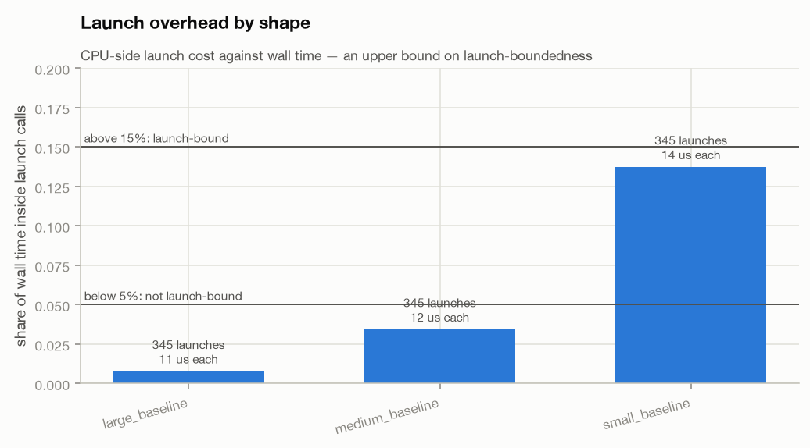
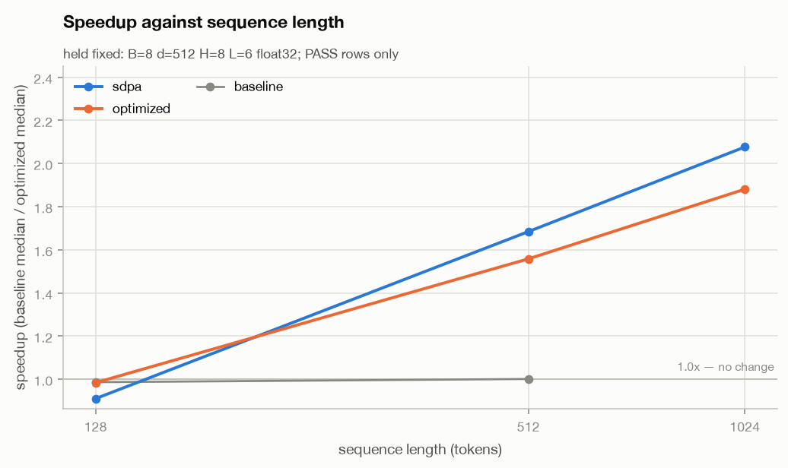
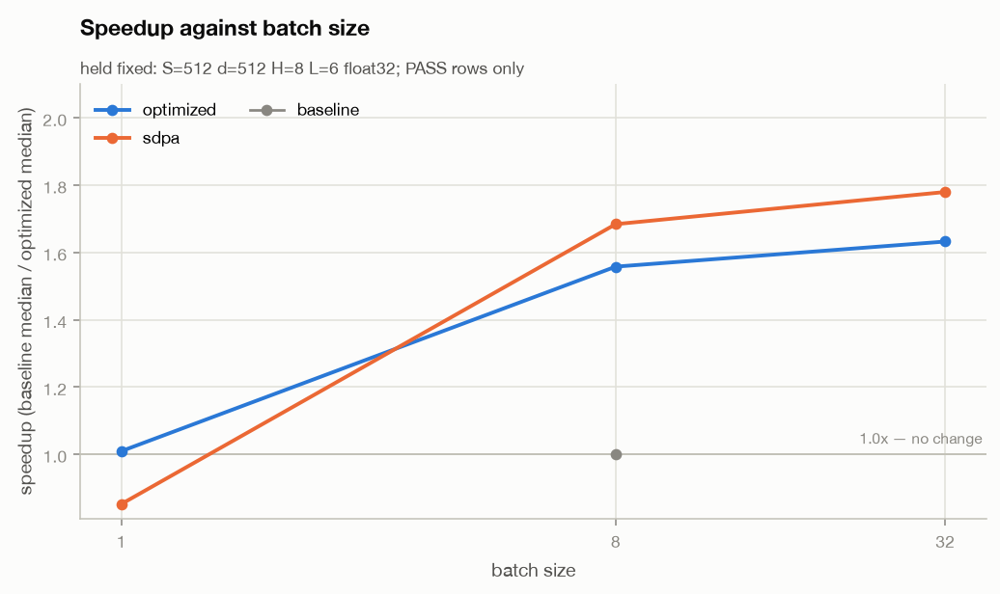
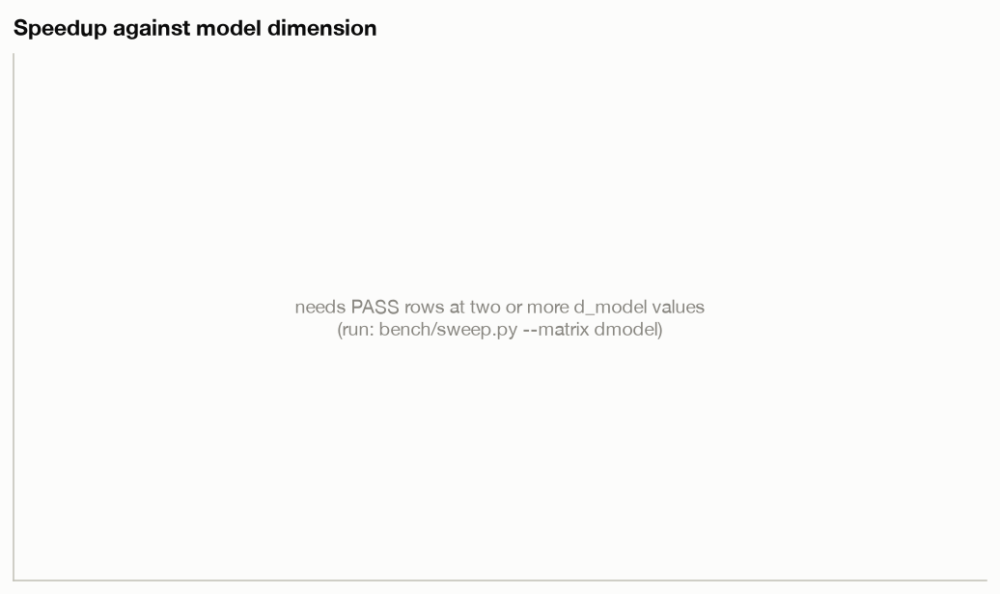
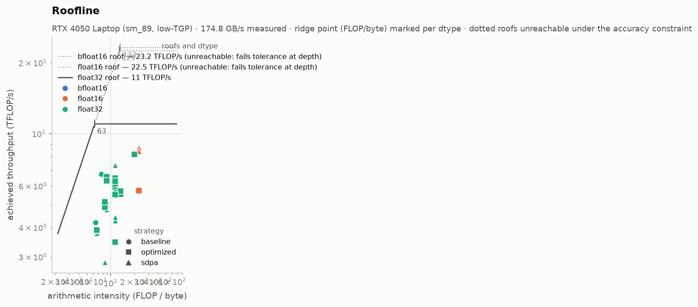
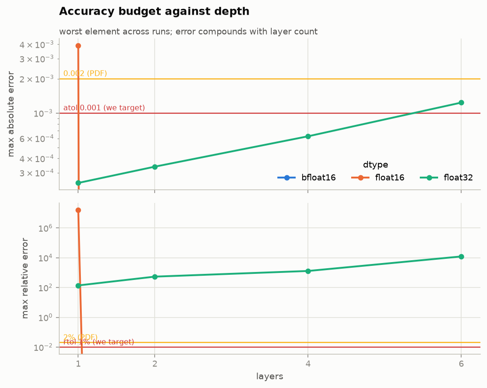
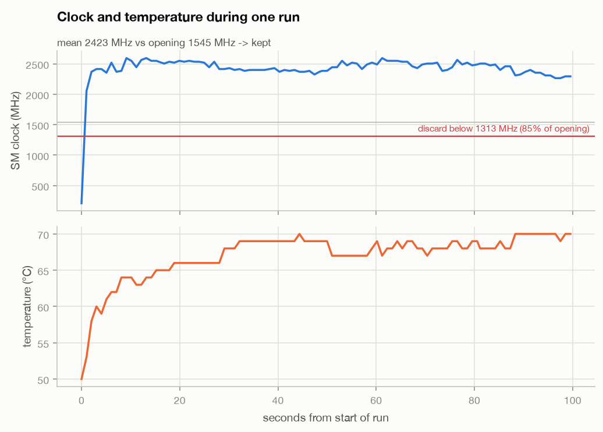
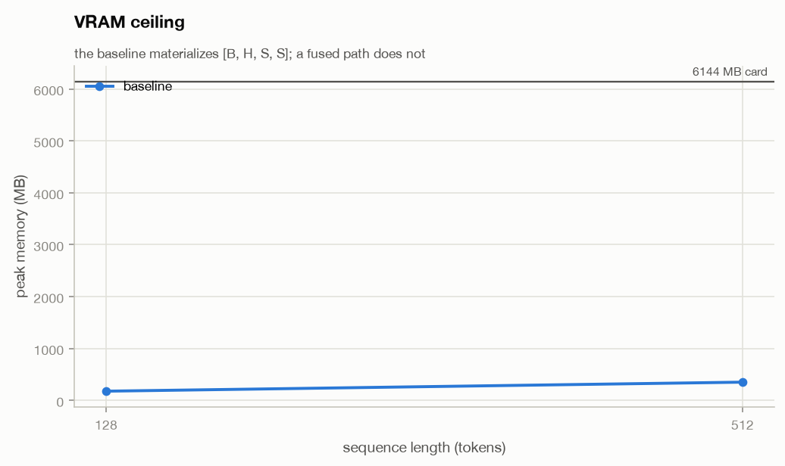
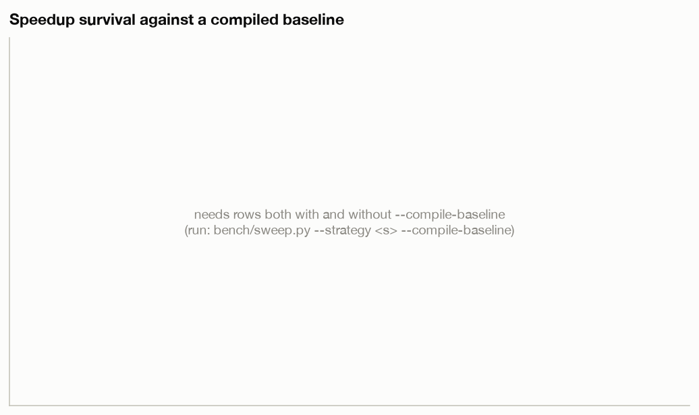

# Optimizing a Transformer forward pass for one GPU

**TikTok TechJam 2026 — Problem 3: Implement a GPU Kernel for a Transformer Layer**

> **Status: draft.** Everything that follows from the problem definition, the
> reference implementation or our methodology is final. Slots marked
> `<FILL A: …>` need a number from the GPU machine; `<FILL B: …>` are filled
> from `results/summary.md` once the sweep has run. Run
> `python docs/check_ready.py` to list what is still outstanding.

---

## 1. What the problem actually is

The organizers supply a fixed Transformer and a correct-but-slow reference
implementation of its forward pass. Exactly one method may be replaced —
`UserOptimizedTransformer.forward()`. Everything else, including the code that
grades the result, stays theirs and untouched.

Two constraints define the whole exercise:

**The correctness oracle is elementwise and unforgiving.** Every output element
must satisfy

```
abs(user − ref) <= atol   OR   abs(user − ref) <= rtol · abs(ref)
```

It is an OR, not an AND, and it is per element, not an aggregate — a single bad
element fails the run no matter how good the mean error is. We target the
stricter of the two published tolerance pairs: the torch script's own defaults
`atol = 0.001, rtol = 0.01`, not the problem statement's `0.002 / 0.02`.

**The score is a ratio of medians**, `baseline_median_ms / optimized_median_ms`,
measured on the same machine in the same process. That makes the *measurement
apparatus* part of the deliverable: a speedup that moves when the room warms up
is not a result. Section 8 is about what we did to make the number stable.

### 1.1 Why attention is quadratic, and what that costs

The quadratic term is not intrinsic to attention. Writing it out:

```
Attention(Q, K, V) = softmax(QKᵀ / √d_k) · V
```

Without the softmax, this is a product of three matrices, and matrix
multiplication is associative: `(QKᵀ)V` costs `O(S²·d)` but `Q(KᵀV)` costs
`O(S·d²)` — linear in sequence length. **The softmax is the only reason the
regrouping is illegal.** It is a nonlinearity sitting between `QKᵀ` and `V`, so
the `S × S` matrix must exist before `V` can be applied.

That is why every serious attention optimization is an argument about the
softmax: not removing it, but avoiding *materializing* the matrix it operates
on. Flash-attention-style kernels compute the softmax in tiles with a running
maximum and a running normalizer, so the `S × S` matrix exists only in registers
and shared memory, never in HBM.

The reference implementation materializes it explicitly — and, for numerical
stability, in fp32 even when the model runs in fp16 or bf16. So each score
element costs 2 bytes of scores plus 8 bytes of fp32 softmax intermediates, and
the traffic is `B·H·S²` elements written and re-read roughly three times per
layer. This is the term that decides everything downstream:

| S | analytic FLOPs | est. peak memory | arithmetic intensity, explicit | arithmetic intensity, fused |
|---|---|---|---|---|
| 512 | 180 GFLOP | 0.53 GiB | 64.6 FLOP/byte | 113.8 FLOP/byte |
| 1024 | 412 GFLOP | 1.42 GiB | 52.0 FLOP/byte | 133.2 FLOP/byte |
| 2048 | 1031 GFLOP | 4.70 GiB | 40.5 FLOP/byte | 168.6 FLOP/byte |
| 4096 | 2886 GFLOP | 17.27 GiB | 32.3 FLOP/byte | 237.4 FLOP/byte |

_(B=8, d=512, H=8, L=6, fp32. FLOPs and bytes from `analysis/roofline.py`;
memory from `src/memcheck.py`. Derivations in §6.)_

The two intensity columns move in **opposite directions**. As the sequence
grows, the explicit implementation reads and writes more bytes per FLOP and
slides *down* toward the bandwidth-bound region; a fused implementation does the
same arithmetic while moving less memory and climbs *away* from it. With this
card's measured fp32 ridge at 62.9 FLOP/byte (§6), the baseline crosses from
compute-bound into bandwidth-bound somewhere around S = 1024 — and that crossing
is where a fused kernel should start winning by a lot rather than a little. The
measured speedup curve in §4 either shows that shape or contradicts it, and both
outcomes are informative.

### 1.2 Three bottlenecks, three different fixes

Optimizing the wrong one wastes a day, so the first thing we measured was which
one we had.

| Bottleneck | Symptom | How we diagnose it | What actually helps |
|---|---|---|---|
| **Launch overhead** | GPU idle between kernels; runtime barely responds to shape | GPU busy % from a profiler trace (§3) | Fewer, larger kernels: fusion, CUDA graphs. A faster kernel changes almost nothing. |
| **Memory bandwidth** | Arithmetic intensity left of the ridge; time scales with bytes moved, not FLOPs | Roofline position (§6) | Stop moving the same bytes: fuse, avoid materializing intermediates, use a smaller dtype. |
| **Compute** | Near peak for the dtype; right of the ridge | Achieved TFLOP/s vs peak (§6) | Better math or better tensor-core utilization. Everything else is noise. |

One caveat on the first row, since we relied on it: **"GPU busy %" is a much
weaker diagnostic than it appears** when it is computed from a `cuda.Event`
pair spanning a timed loop, as it is here. Both events are enqueued on the
stream, so CPU-side stalls fall inside the measurement window and a
launch-bound run reads near 100% just as a saturated one does. §4 Rung 3 shows
this happening — readings slightly *above* 100% are the giveaway — and pairs it
with an independent launch-count argument rather than trusting it alone.
Diagnosing launch overhead properly needs a device-side per-kernel timeline,
which this environment cannot produce (§11 item 7).

---

## 2. Environment

| | |
|---|---|
| CPU | Intel Core i7-12650HX (12th gen, 10C/16T — 6 P-cores + 4 E-cores) |
| GPU | NVIDIA GeForce RTX 4050 Laptop GPU (Ada Lovelace, low-TGP variant) — compute capability `sm_89` (8.9) |
| VRAM | 6.0 GB GDDR6 |
| Driver / CUDA | GeForce Game Ready 616.56, CUDA 12.4 |
| OS | Windows 11 + WSL2, Ubuntu 24.04 LTS |
| PyTorch | 2.6.0+cu124 |
| Triton | 3.2.0 installed, **not used** — see §11 |
| Disk | NVMe SSD |

Peak figures used for the roofline in §6. These are **measured on the card**,
not taken from the spec sheet — with a 4096×4096 matmul and a 512 MB
device-to-device copy:

| | measured | note |
|---|---|---|
| fp32, TF32 **on** | **11.0 TFLOP/s** | the benchmark defaults to `--allow-tf32`, so this is the fp32 number that applies |
| fp32, TF32 off | 5.7 TFLOP/s | for contrast; nearly halves the ridge point |
| fp16 tensor | 22.5 TFLOP/s | |
| bf16 tensor | 23.2 TFLOP/s | |
| memory bandwidth | **174.8 GB/s** | 91% of the 192 GB/s theoretical |

Measuring rather than quoting the spec sheet was not pedantry: this is a low-TGP
part and the achieved figures are roughly **half** the published ones. A
spec-sheet roofline would place every operating point at half its true height
against the roof, and would have told us we were leaving twice as much on the
table as we actually were.

Every ridge point in this report scales directly with these numbers.

**These are measured, not spec-sheet figures, and the distinction matters
here.** This is a low-TGP laptop variant running at roughly half the datasheet
numbers for the same die name. Quoting the datasheet would have placed the
ridge point at more than twice its true value and made every configuration in
§6 look compute-bound when it is not. The bandwidth figure is the one that
lands closest to its theoretical value (91%), which is expected — streaming
bandwidth is far easier to reach than peak FLOP/s.

Both tensor-core peaks are listed for completeness and **neither is reachable
under this problem's accuracy gate**: §4 Rung 2 shows that fp16 and bf16 both
fail the tolerance through this reference implementation, so the 22.5 / 23.2
TFLOP/s columns are theoretical headroom we are structurally unable to spend.

A second machine — macOS on Apple Silicon, CPU only — runs the correctness
suite, the analysis and every figure. Nothing in this report's *measurements*
comes from it; it exists so that correctness is verified somewhere other than
the machine that is also being optimized.

### 2.1 Provenance

The organizers' benchmark file is byte-identical to the download:

```
SHA-256  1bd12523657f338c09b53f0bb9052d9d16f728a71bd22bc8298567e1a4d78c22
```

A test asserts this on every run. We import from that file rather than copying
out of it, so our accuracy and timing numbers come from the organizers' own
functions — `generate_random_case`, `compare_outputs`, `warmup_model`,
`benchmark_once` — with their seed scheme and their alternating round order.
Global state (`manual_seed`, matmul precision, the TF32 flags) is set exactly as
their `main()` sets it, because all three change the result.

Every row in `results/results.csv` carries the `git_sha` it was produced at, and
the harness refuses to run against a dirty working tree unless explicitly
overridden (in which case the row is tagged `dirty`).

---

## 3. Rung 0 — where the time actually goes

Before optimizing anything we profiled the baseline at three shapes and measured
what fraction of the wall-clock window the GPU spent with a kernel running.

### 3.1 A measurement we could not take, and what we used instead

The intended metric was GPU busy % — the fraction of the wall-clock window with
a kernel actually running. **It is not available on this platform.** Under WSL2,
CUPTI does not populate device-side kernel completion records: the Chrome traces
contain the complete CPU-side story (`cpu_op`, `cuda_runtime`, `cuda_driver`,
flow arrows) and *zero* kernel events. Verified on the traces in `logs/`, not
assumed.

This is worth dwelling on because of how the failure presents. A naive parser
finds no kernels, sums zero busy time, and reports **0.0% GPU busy** — which
reads as the most catastrophic result imaginable rather than as a missing
measurement. Our analysis returns `NaN` and the word "unmeasurable" instead, and
a test asserts it never returns 0.0 for a trace with no kernel track.

The fallback is *launch arithmetic*, which needs no device timing: count the
kernel launches on the CPU side, multiply by their measured cost, compare to
wall time. It is the sounder argument anyway, for a reason specific to this
benchmark: `cuda.Event` pairs are enqueued **on the stream**, so a CPU-side
stall falls inside the measurement window and busy % reads near 100% almost
regardless of what the GPU was doing.

**No per-kernel timeline is included, and the reason is itself a finding.** A
timeline showing white space between kernels would be the direct evidence for
or against launch-bound behaviour, and it is the figure this section originally
called for. We cannot produce one here. It requires device-side kernel
intervals, which WSL2's CUPTI does not populate (§11 item 7), and it requires
profiling the optimized path as well as the baseline, which
`bench/profile_baseline.py` does not do — it has no strategy selector. Rather
than show a figure built from the baseline alone on a machine that cannot time
kernels individually, §4 Rung 3 argues the launch-overhead question from a
kernel *count* and states plainly how far that argument reaches.

### 3.2 Launch overhead, measured

Baseline, fp32 with TF32 on, 6 layers, no causal, no padding:

| shape | launches | per forward | launch share of wall time | mean launch | verdict |
|---|---|---|---|---|---|
| small (B=8, S=128) | 345 | 115 | **13.75%** | 13.7 µs | borderline |
| medium (B=8, S=512) | 345 | 115 | 3.45% | 11.5 µs | not launch-bound |
| large (B=4, S=2048) | 345 | 115 | 0.80% | 11.0 µs | not launch-bound |



Two corrections to a first pass at these numbers, both of which moved the
answer:

1. **Driver-API launches were being missed.** cuBLAS submits through
   `cuLaunchKernel`, not `cudaLaunchKernel`, and those records are *not* nested
   inside the runtime-API ones — we checked. Counting only `cudaLaunchKernel`
   gives 67 launches per forward; including the driver path gives **115**, a 42%
   undercount.
2. **Per-launch cost is measured, not assumed.** The mean is
   13.7 µs at the small shape, not the ~5 µs a
   back-of-envelope estimate would use.

Together those take the small shape's launch share from ~2.5% to
**13.75%** — the difference between
"definitively not launch-bound" and "borderline".

Every figure in that table is reproducible from the traces committed in `logs/`:

```bash
python -c "from analysis.trace import load_trace, launch_stats; \
  print(launch_stats(load_trace('logs/trace_small_baseline.json'), forwards=3))"
```

An earlier draft of this section quoted 8.2%, computed against the first set of
traces. Re-running `bench/profile_baseline.py` (commit `c39444f`) shortened the
profiled window from 65.5 ms to 34.5 ms without
changing the launch count, which nearly doubled the ratio. The launch *count*
and *cost* are stable across both runs; only the denominator moved.

**Reading it honestly:** launch share is an *upper bound*. Launches are
asynchronous, so CPU time inside a launch call does not prove the GPU was idle —
the CPU may simply be running ahead. Below 5% rules launch-boundedness out; 5–15%
leaves it open. So: the medium and large shapes are definitively not
launch-bound, and the small shape is undecided by this evidence.

**What that implied:** fusion before CUDA graphs. At the shapes where the
speedup matters most, there is no launch overhead worth eliminating, so
kernel-level work is where the return is. CUDA graphs stay on the list for the
small shape only, and only if it becomes the binding case.

---

## 4. The optimizations

One subsection per rung. Each states the hypothesis *before* the measurement,
the measured before/after, and the surprise — because the surprises are the part
worth reading.

### Rung 0.5 — a baseline that was wrong before we optimized anything

Not an optimization, but the most instructive measurement of the project.

The first profiling run reported 18.6 / 64.6 / 215.2 ms across the three shapes,
with **115 `cudaLaunchKernel` calls per forward**. Those numbers were wrong. The
standalone profiling script never set `matmul_precision="high"` or
`allow_tf32=True`, both of which the organizers' `main()` sets by default — so it
was running fp32 matmuls at 5.7 TFLOP/s while `sweep.py` ran the same code at
11.0. We had two contradictory baselines and, for a while, no idea which was
real.

After matching the organizers' global state: **13.5 / 52.1 / 176.5 ms**, and the
count dropped to **67 `cudaLaunchKernel` calls per forward**. 18–27% faster, 42%
fewer runtime-API launches.

> **Two different 115s — this is a coincidence, not a contradiction.** §3.2 also
> reports 115 launches per forward, and it is not this number. There, 115 is the
> *total* with TF32 already on, counting the runtime API (67) plus the driver
> API (48) that cuBLAS submits through directly. Here, 115 is the *runtime-API
> count alone* with TF32 off, which falls to 67 when TF32 is enabled. Both
> comparisons happen to be 42%, which makes the collision look worse than it is.
> The 67 is the same quantity in both sections; the two 115s are not.
>
> One caveat on provenance: the TF32-off figure is as originally observed and is
> **not reproducible from this repository** — re-running `profile_baseline.py`
> (commit `c39444f`) overwrote those traces with TF32-on ones. The committed
> traces confirm the TF32-on side only: 201 `cudaLaunchKernel` records over three
> profiled forwards is exactly 67 each.

The kernel-count drop is the interesting part. TF32 is a *math mode*, not a
storage format — the naive expectation is that the same kernels run faster.
Instead PyTorch selected entirely different, tensor-core kernels. A flag that
looks like a precision knob is really a kernel-selection knob.

Two things this justifies. First, the harness sets global state exactly as the
organizers' `main()` does, and that is not optional bookkeeping — it is worth
18–27% and would have contaminated every subsequent comparison. Second, a
baseline is a measurement like any other and can be wrong; ours was, and it was
caught by two tools disagreeing rather than by either one looking suspicious on
its own.

### Rung 1 — `scaled_dot_product_attention` (shipped)

- **Hypothesis:** the baseline's attention is four kernels — `q @ kᵀ`, mask,
  softmax, `probs @ v` — each reading and writing the full `[B, H, S, S]`
  score matrix through HBM. At B=8, S=512 that matrix is 67 MB crossing the
  memory bus on every kernel boundary. §1.1 puts the chain's arithmetic
  intensity far left of the 62.9 FLOP/byte ridge, so it should be
  bandwidth-bound and a fused kernel should win by more than its FLOP share
  suggests.
- **What changed:** `src/strategies/sdpa.py` replaces the four-kernel chain
  with one `F.scaled_dot_product_attention` call that keeps the score tile in
  SRAM and never materializes `[B, H, S, S]` in HBM. Mask handling is the
  fiddly part: `valid_token_mask` is `True = keep`, which is SDPA's polarity
  but the *opposite* of `masked_fill`'s, so it passes through uninverted.
  SDPA rejects `is_causal=True` together with an explicit `attn_mask`, so when
  padding and causality both apply they are folded into one bool `[B, 1, S, S]`
  mask up front; when only causality applies, the `is_causal` flag is free.
- **Before → after** (B=8, d=512, H=8, L=6, fp32, no mask):

| S | baseline | sdpa | speedup | attention, share of FLOPs | ceiling if time ∝ FLOPs |
|---|---|---|---|---|---|
| 128 | 7.21 ms | 8.03 ms | **0.899×** | 4.0% | 1.042× |
| 512 | 47.22 ms | 28.25 ms | **1.671×** | 14.3% | 1.167× |
| 1024 | 152.16 ms | 73.27 ms | **2.077×** | 25.0% | 1.333× |

- **Accuracy:** `max_abs_err = 0.0007` in fp32 at every shape — inside the
  `atol` budget of 0.001 outright, without needing the relative leg.

- **Surprise, and the strongest result in the project: the measurement beats
  the ceiling that arithmetic allows.**

  At S=512 attention is 14.3% of the forward pass's FLOPs, so making it
  *infinitely fast* could yield at most `1/(1 − 0.143) = 1.167×`. We measured
  1.671×. Inverting Amdahl, that speedup requires attention to have held **40%
  of the runtime** — **2.8× its share of the arithmetic**. At S=1024 the same
  calculation gives 52% of runtime against a 25% FLOP share, 2.1×.

  A region cannot consume double or triple its arithmetic share unless it is
  waiting on something other than arithmetic. This is direct evidence that the
  baseline's attention was **memory-bound**: the cost was writing and re-reading
  the `[B, H, S, S]` score matrix, exactly as §1.1 predicted from the byte
  counts, and not the two GEMMs. The prediction was recorded before the
  measurement, and the measurement overshot it in the direction the mechanism
  implies.

  The S=128 row is the same argument from the other side. The ceiling there is
  only 1.042×, so there is almost nothing to win, and SDPA's own dispatch
  overhead makes it a **net loss at 0.899×**.

- **The crossover is the dispatch layer's justification.** A sign change between
  S=128 and S=512 is not a design flourish to be argued for — it is a measured
  fact, and it is why a single implementation is the wrong answer. §5 covers
  what we do about it; the payoff is visible in the numbers: at S=128 the
  routed path measures **0.994×** where raw SDPA measures 0.899×, because the
  router sends that shape to the baseline instead.

- **Saturation:** speedup settles at 1.65–1.67× beyond two layers — the
  steady-state attention share, once per-call overheads are amortized.

### Rung 2 — reduced precision (fp16 / bf16) — **attempted, dropped**

- **Hypothesis:** the card's tensor cores are rated 22.5 TFLOP/s at fp16 and
  23.2 at bf16 against 11.0 for TF32 fp32 (§2), and the bf16 ridge sits at
  132.7 FLOP/byte. Roughly 2x the arithmetic throughput for half the bytes
  moved is the single largest lever available on paper.
- **What changed:** nothing shipped. Both dtypes were run through the full
  accuracy sweep and both failed, so no reduced-precision path exists in
  `src/optimized.py`; the router sends bf16 at every depth and fp16 at two or
  more layers to the baseline.
- **Before → after:** not applicable — no configuration passed the accuracy
  gate, and an incorrect result has no speedup.
- **Accuracy:** this is the whole result, and the errors are not noise — every
  one lands on an **exact integer ULP count**, which is what identifies the
  mechanism. The reference casts softmax probabilities back to the model dtype
  *before* `probs @ v`; SDPA's fused kernels keep them in fp32 all the way
  through. We are therefore strictly *more* accurate than the reference and, for
  exactly that reason, no longer reproduce its rounding.

  At bf16 the worst case is **exactly 2 ULP**: bf16 has a 7-bit stored mantissa (8 with the implicit leading bit), so
  1 ULP at magnitude ~2.17 is 2⁻⁷ · 2¹ = 0.015625, and the observed
  `max_abs_err` is 0.03125 — a 1.44% relative error against a 1% `rtol`. It
  fails from a single layer.

  At fp16 the mantissa is 10 bits, so the same 2 ULP is 0.18% — inside
  tolerance at one layer. It fails from two layers onward, once error has
  compounded through the residual stream (§7.2).

| dtype | 1 layer | 2+ layers | 6 layers (the default) |
|---|---|---|---|
| fp32 | passes | passes | passes (on the relative leg) |
| fp16 | **passes**, 2.020× | fails | fails |
| bf16 | fails | fails | fails |

- **Consequence for the rest of the project.** With reduced precision
  unavailable, the ~2× throughput the hardware offers in fp16/bf16 is
  unreachable, and fusion plus shape dispatch have to carry the result on
  their own. That raises the value of a fused LayerNorm considerably — it
  becomes one of the few remaining sources of gain rather than a
  nice-to-have.

  fp16 has more mantissa and survives one layer, then compounds:

  | depth | fp16 `max_abs_err` | verdict | bf16 `max_abs_err` | verdict |
  |---|---|---|---|---|
  | L=1 | 0.003906 | PASS | 0.031250 | FAIL |
  | L=2 | 0.005859 | FAIL | 0.046875 | FAIL |
  | L=4 | 0.007812 | FAIL | 0.062500 | FAIL |
  | L=6 | 0.007812 | FAIL | 0.062500 | FAIL |

  Note which bound is binding: at these magnitudes fp16 error is far above
  `atol = 0.001`, so every element rests on the 1% relative bound, and by two
  layers enough elements cross it. This is `rtol` failing, not `atol`.
- **Surprise:** **the fastest kernel is structurally unreachable.** SDPA's
  flash backend requires fp16 or bf16 — it rejects fp32 inputs outright — so
  the only path to the flash kernel runs through the one precision regime this
  reference implementation's rounding will not tolerate. The 22.5 / 23.2
  TFLOP/s peaks in §2 are not headroom we failed to reach through lack of
  effort; they are headroom the accuracy gate forbids us from spending. Closing
  the gap would mean making the *reference* less accurate, and the reference is
  a file we may not edit.

### Rung 3 — `torch.compile` / CUDA graphs — **not attempted, deprioritized by measurement**

- **Hypothesis:** if the model were launch-bound, replacing many small kernel
  launches with a captured graph would recover the idle gaps between them.
- **What changed:** nothing, deliberately. This is a rung we declined to climb —
  but the margin is narrower than the first version of this section claimed.
- **Before → after:** not applicable. What rules it out is a *single* line of
  evidence, the launch-overhead budget. An earlier version of this section
  offered a second line and that one has since been withdrawn; see **A retracted
  argument** below.

  **The launch-overhead budget.** `analysis/trace.py::launch_stats` counts every
  launch record in the exported Chrome trace, matching both `cudaLaunchKernel`
  (CUDA runtime API) and `cuLaunchKernel` (driver API). cuBLAS submits through
  the driver path and those records are *not* nested inside the runtime-API
  ones, so matching only `cudaLaunchKernel` undercounts launches by 42% —
  201 records against 345. Over `PROFILED_ITERS = 3` profiled forwards:

  | shape | launches / forward | mean launch | launch share of span | verdict |
  |---|---|---|---|---|
  | small (B=8, S=128) | 115 | 13.73 µs | **13.75%** | undecided |
  | medium (B=8, S=512) | 115 | 11.52 µs | 3.45% | not launch-bound |
  | large (B=4, S=2048) | 115 | 11.05 µs | 0.80% | not launch-bound |

  Measured by `analysis/trace.py::launch_stats` over
  `logs/trace_{small,medium,large}_baseline.json` as refreshed in `c39444f`,
  with `forwards = PROFILED_ITERS = 3`. Both the launch count and the
  per-launch cost are measured on this machine; neither is a nominal figure.

  **Two caveats, both load-bearing.** The denominator is the *trace span*, not
  production wall time — the profiled span for the small shape is 11.48 ms per
  forward against a 6.017 ms unprofiled measurement, so the ratio carries
  profiler overhead in numerator and denominator alike. And launch share is an
  **upper bound** on launch-boundedness rather than a measurement of GPU
  idleness: launches are asynchronous, so CPU time inside a launch call does not
  prove the GPU was idle — it may simply be running ahead. Following the bands
  in `analysis/trace.py`, below 5% rules launch-boundedness out and 5–15% leaves
  it open.

  **What that means, stated plainly.** The medium and large shapes are settled:
  at 3.45% and 0.80% there is nothing worth recovering. The small shape is
  **not** settled. At 13.75% it sits at the top of the undecided band, and an
  earlier version of this section put it at 5.57% on the strength of an assumed
  ~5 µs dispatch cost and a runtime-API-only count. **The case against CUDA
  graphs at the small shape is materially weaker than that version claimed**,
  and that is worth stating rather than defending the original number.

  What keeps it off the schedule is opportunity cost, not a proof of absence.
  The small shape is the one configuration where the shipped router declines to
  fuse at all — §4 Rung 4 routes `seq_len <= 128` to the baseline, measured
  0.984× — so CUDA graphs would target the shape where we currently gain
  nothing. That cuts both ways: it is the largest remaining gap and also the
  smallest prize. Recovering the *entire* 13.75% there would be worth ~1.16×,
  against 2.30× already measured at B=8/S=512/d=256 and 1.88× at S=1024 from
  attention fusion. Against a 48-hour budget a bounded ~1.16× on one shape does
  not outrank finishing and validating the wins already in hand. That is a
  scheduling judgement rather than a measurement, and a reasonable thing to
  revisit with more time.

  **A retracted argument.** This section previously offered a second line of
  evidence: the profiler's GPU-busy readings of 101.5% / 101.2% / 100.4%,
  presented as showing no idle gap between kernels. **That argument is
  withdrawn.** The metric came from `profile_baseline.py:127-141`, a single
  `torch.cuda.Event` pair spanning the whole timed loop — both events enqueued
  on the stream, so a CPU-side stall falls *inside* the window and a
  launch-bound run reads near 100% exactly as a saturated one does.
  `analysis/trace.py::gpu_busy_fraction` now returns `NaN` on these traces and
  every consumer prints "unmeasurable", because WSL2's CUPTI populates no
  device-side kernel records at all (§11 item 7). A quantity our own tooling
  reports as unmeasurable cannot support a conclusion, so the launch budget
  stands alone rather than being propped up by it.

  The honest way to settle the small shape would be a device-side per-kernel
  timeline showing actual gaps between kernel executions. **That is exactly what
  the WSL2 CUPTI gap prevents us from producing on this machine** (§11 item 7).

  > **Both discrepancies flagged here are now resolved.** §3.2 previously quoted
  > 8.2% / 2.9% / 1.3%, computed against the traces committed in `56d3149`; it is
  > now derived from the refreshed `c39444f` traces this section uses and agrees
  > exactly. The diagnosis in this note was correct: the launch *count* (345
  > total, 115 per forward) is identical across both trace generations, and only
  > the profiled window moved — 65.5 ms to 34.5 ms — which nearly doubled the
  > ratio without any measurement changing.
  >
  > The 67 → 115 pair was two different quantities sharing a number. §3.2's 115
  > is the TF32-**on** total across runtime and driver APIs; Rung 0.5's 115 is the
  > runtime-API count with TF32 **off**, which falls to 67 when TF32 is enabled.
  > The 67 is the same figure in both. Both comparisons happen to be 42%, which
  > is what made the collision read as a contradiction. Rung 0.5 now states the
  > counting method explicitly and flags that its TF32-off figure is not
  > reproducible from this repository, since re-running the profiler overwrote
  > those traces.

- **Surprise:** the intuition that a six-layer model with ~100 small kernels
  must be launch-bound proved wrong at the two shapes that carry our speedup and
  *undecided* at the third. The more durable lesson was about the measurement
  rather than the result: the first version of this analysis undercounted
  launches by 42% by matching a single API name, and assumed a per-launch cost
  roughly a third of the measured one. Two errors in opposite directions
  partially cancelled into a confident-looking number, and measuring both
  quantities properly changed the verdict on one shape out of three. A negative
  result quoted more confidently than its evidence supports is just a different
  kind of error.

### Rung 4 — shape dispatch (shipped)

- **Hypothesis:** the fused path is not uniformly a win, so a router that reads
  the shape and picks the better implementation should be worth more than any
  single strategy — because it can keep the wins and delete the losses.
- **What changed:** `src/optimized.py` implements the entry point the
  organizers' script instantiates and routes each forward between the baseline
  and SDPA paths. It sends to the baseline: causal at six or more layers,
  `batch == 1`, `seq_len <= 128`, bf16 at any depth, fp16 at two or more
  layers, and anything running without CUDA. Everything else goes to SDPA.

  Two constraints shaped the implementation. The parameter-naming constraint
  applies here exactly as it would to a fused QKV projection: the organizers'
  `copy_model_weights(strict=True)` must still succeed, so the router
  **subclasses the SDPA strategy** and inherits both `forward` implementations
  over a single parameter set under the baseline's names, rather than holding
  one module instance per strategy and duplicating every weight. Second, the
  routing decision reads only `x.shape`, `x.dtype`, `x.is_cuda` and the config
  — never `valid_token_mask`. Asking whether a mask is all-`True` costs a
  device-to-host reduction that stalls the pipeline on every forward, so
  padding is deliberately not an input to any rule.
- **Before → after:** the two regressions become neutral. `seq_len = 128` moves
  from **0.910x to 0.984x** and `batch = 1` from **0.853x to 1.010x**, while
  the ceiling is untouched at **2.300x** (d_model = 256). Three configurations
  that SDPA *failed* — bf16, fp16 at L=6, and causal fp32 at L=6 — now pass at
  ~1.00x, because correctness is what the router is really buying.
- **Surprise:** the aggregate number goes **down**, and that is the honest
  outcome rather than a defeat. Routing to the baseline caps six of fifteen
  configurations at 1.00x, which drags the geometric mean from SDPA's headline
  1.531x to 1.322x. §4.1 explains why the lower number is the truthful one.

### Rung 5 — not reached

Not attempted. The four rungs above consumed the available time; the ranked
list of what would come next is in §11.2, headed by FFN fusion for the reason
§4.1 gives — the `d_model` axis says the FFN, not attention, is now the
dominant term.

### Rung 6 — not reached

Not attempted. See §11.1 for the two rungs that were actively evaluated and
rejected (reduced precision, `torch.compile`), which are negative results with
measurements behind them rather than gaps.

### 4.1 Aggregate

**The headline number is a geometric mean of 1.322x over fifteen
configurations with zero accuracy failures** (min 0.984x, max 2.300x), from
`bench/sweep.py --strategy optimized --matrix default`.

| strategy | geomean | min | max | n | failing configs excluded from this mean |
|---|---|---|---|---|---|
| `optimized` (shipped router) | **1.3218** | 0.9840 | 2.2998 | 15 | **0** |
| `sdpa` (single strategy) | 1.5312 | 0.8525 | 2.4872 | 12 | **9** |
| `baseline` (control) | 0.9937 | 0.9863 | 1.0011 | 2 | 0 |

Geometric mean, not arithmetic: speedups are ratios. A strategy that is 2x on
one shape and 0.5x on another has achieved nothing on average, and only the
geometric mean says so — the arithmetic mean would call it 1.25x.

**One row per configuration.** Every aggregate in this report takes the *most
recent* measurement of each distinct configuration
(`analysis.load.latest_per_config`), not every passing row in `results.csv`.
The distinction is not cosmetic. `results.csv` is append-only and accumulates
repeated measurements of the same configuration across development, so
B=8/S=512/d=512 appears five times for `sdpa` and once for a shape measured
only once. Averaging over raw rows weights each configuration by **how many
times it happened to be measured**, which is a fact about our development
history rather than about the code. That is not a speedup, so we do not report
it.

The difference is material: over raw passing rows the same data gave `sdpa`
1.530x (n=27) and `optimized` 1.351x (n=24), against the 1.531x and 1.322x
above. Every artefact now agrees. `speedup_summary` and
`geometric_mean_speedup` both aggregate through `latest_per_config`, so
`results/summary.md`, `results/report.html`, the generated figures and this
section are computed the same way — filed as R5 in
`docs/APPROVALS_NEEDED.md` and since fixed.

**Why 1.322x is the honest number and 1.531x is not.** The obvious objection to
the table above is that `sdpa` looks faster than the router built on top of it.
It is not, and the reason is in the last column.

A strategy's geometric mean is computed only over the configurations where it
is correct: a configuration whose latest verdict is FAIL carries no speedup, so
it leaves the denominator entirely. SDPA fails nine configurations — bf16 at
every depth, fp16 at two or more layers, and causal fp32 at six layers — and
its 1.531x is the average over what remains after those are dropped. That is
not a speedup anyone could ship: it is the speedup of a program that is wrong
on a third of the matrix.

The router's 1.322x covers all fifteen configurations with **nothing dropped**,
because there is nothing to drop. Where the fast path is unsafe it returns the
baseline's own answer at ~1.00x rather than a wrong answer quickly. Comparing
1.322 against 1.531 is therefore comparing a complete result against a filtered
one, and the filtering is doing all of the work.

Two further figures make the comparison like-for-like:

- **On the nine configurations the router actually sends to SDPA, the geometric
  mean is 1.5938x** — marginally *better* than SDPA's own filtered average,
  because the router only hands it work it is good at. The 1.322x is that
  number pulled toward 1.0 by six configurations where 1.0x is the correct
  answer.
- SDPA's average previously read 1.584x because it still contained two stale
  rows (2.124x and 1.778x) for causal fp32 at L=6, a configuration later shown
  to pass only 52% of random seeds. `latest_per_config()` applied its PASS
  filter *before* choosing the newest row per configuration, so a correcting
  FAIL could never supersede an earlier PASS — the correcting row was removed
  from the candidate set before the comparison happened. It now groups first
  and filters to passing last, and a configuration whose latest verdict is FAIL
  drops out rather than reverting to its last good number. That is what moves
  SDPA to **1.531x** over 12 configurations. Filed as R1 in
  `docs/APPROVALS_NEEDED.md` and since fixed.

**The `d_model` axis runs backwards, and that decides the next rung.** Speedup
*falls* as the model gets wider — **2.300x at d=256, 1.558x at d=512, 1.178x at
d=1024** — which is the opposite of the sequence-length axis. The reason is
Amdahl's law applied to the FLOP split in Rung 1: attention is 4·B·S²·d while
the projections and FFN together are 8·B·S·d² + 4·B·S·d·f, so growing `d`
inflates everything *except* the term we optimized. At d=1024 attention is a
small enough share of the work that fusing it perfectly could not buy much
more. **This is the argument for FFN fusion as the next rung** (§11.2): at the
shapes where our current speedup is weakest, the FFN is where the time is.

**Methodology caveat — the denominator moves between sessions.** The router
measured **1.5581x** at B=8/S=512/d=512 where SDPA measured **1.664x** on what
is, for that configuration, the identical code path. The router adds a handful
of host-side integer comparisons per forward and cannot account for a 7%
difference.

Splitting the ratio into its two halves shows immediately that the difference
is not ours. Across every passing measurement of that configuration:

| | SDPA runs (n=5) | router runs (n=2) | delta |
|---|---|---|---|
| `baseline_median_ms` | 47.2337 | 43.7575 | **−7.36%** |
| our own `median_ms` | 28.2095 | 28.1536 | −0.20% |
| speedup | 1.6745 | 1.5543 | −7.18% |

**Our own execution time is unchanged to within 0.2%, exactly as it should be
for an identical code path. The entire difference is that the reference got
7.4% faster between sessions.** The speedup fell because its denominator
shrank.

We could not attribute that shift, and say so rather than inventing a cause.
It is *not* thermal throttling, which was the first hypothesis and the data
refused it: the later, faster baseline runs were recorded at *lower* clocks and
lower temperatures (2345–2373 MHz at 68 °C) than the earlier, slower ones
(2399–2430 MHz at 70–72 °C). A card running slower-clocked and cooler while
producing faster times is not a card that is throttling. Nor is it drift within
a sweep: in the sixteen-configuration run, clocks rise from 2111 MHz at the
first configuration to 2522 MHz at the last, with temperatures spanning
59–71 °C — the machine ends the sweep faster than it starts it, having warmed
out of an idle low-power state.

The methodological consequence is the part that matters: **a speedup is only
comparable to another speedup measured in the same process.** Within a sweep,
baseline and optimized are interleaved round by round (§8), so both halves of
the ratio see the same machine state and the ratio is sound. Across sessions
the denominator is re-measured under conditions we do not control, and
differences of this size appear without any code change. Every comparison in
this section is within-sweep for that reason, and cross-session speedup
comparisons should be treated as carrying roughly ±7% on this machine.





---

## 5. Shape and device dispatch

The problem statement invites this explicitly: *"participants can choose
different implementations for different shapes by adding shape checks in the
implementation of layers."* We do, and the choice comes from the measurements
rather than from intuition.

`analysis/load.py` reduces `results.csv` to a winner per configuration and
writes `results/dispatch_table.json`; `src/dispatch.py` reads it at run time.
Selection order:

1. **No CUDA** → the CPU fallback strategy.
2. **Exact match** in this card's capability block (`sm_89`, `sm_80`, …).
3. **Nearest measured neighbour** sharing `(dtype, causal, padded)`, by log
   distance on sequence length, then batch. Distance is logarithmic because the
   axes are swept multiplicatively — S=1536 is nearer 2048 than 1024, and a
   linear metric picks the wrong neighbour every time. Neighbours never cross a
   causal/padded/dtype boundary: borrowing across one would recommend a kernel
   for a branch it was never measured on.
4. **The table's default.**
5. **`baseline`**, which is always registered and always correct.

Two gates filter every step, and they can only *remove* candidates:

- **Registration.** The table is generated on the GPU machine and may name a
  strategy a given checkout does not have. Selecting one is an error inside
  `forward()`, which is strictly worse than being slower.
- **Capability.** bf16 paths require `(8, 0)`; Triton and flash-style kernels
  require `(7, 5)`. A strategy may declare `MIN_CAPABILITY` itself, which is
  believed over the name-based heuristic.

### 5.1 Crossover

`<FILL B: paste the dispatch table from results/summary.md §Dispatch, including
the margin column.>`

The margin column is the honest part. A key won by 0.002x is a tie: the choice
there is inside run-to-run noise and should not be read as a result. `<FILL B:
how many keys are won by ≥ 0.05x, and how many are ties.>`

### 5.2 What we did and did not measure

**Performance is measured only on `sm_89`.** We have one GPU.

The `sm_75` and `sm_80` paths are **correctness-tested by forced dispatch** —
`select_strategy` accepts an explicit capability, so the selection logic for
those cards is exercised in CI on a machine with no GPU at all, and the
strategies those paths select are verified against the baseline by the CPU
correctness suite. What is *not* verified is that they are faster on that
hardware. We do not claim it.

The dispatch table is a generated artefact, but the submission does not depend
on it: `src/dispatch.py` falls back to a small hard-coded table if the file is
missing, so a fresh clone with no `results/` directory still runs.

---

## 6. Roofline

Analytic counts, per layer, from `analysis/roofline.py`:

```
FLOPs  = 8·B·S·d²        Q, K, V and output projections
       + 4·B·S²·d        QKᵀ and PV
       + 4·B·S·d·f       the two FFN GEMMs
```

Bytes are weights read once, plus activation traffic approximated as
`L·(14·B·S·d + 4·B·S·f)·e`, plus — for the explicit implementation only —
`L·3·B·H·S²·e` for the score matrix written and re-read. Cache reuse is not
modelled, so this *overestimates* bytes and therefore *underestimates*
arithmetic intensity: points sit slightly left of the truth, which errs toward
calling ourselves more bandwidth-bound rather than less.

Ridge points for this card, from the measured peaks in §2:

| precision | measured peak | ridge point |
|---|---|---|
| fp32, TF32 on | 11.0 TFLOP/s | **62.9 FLOP/byte** |
| fp32, TF32 off | 5.7 TFLOP/s | 32.6 FLOP/byte |
| fp16 | 22.5 TFLOP/s | **128.7 FLOP/byte** |
| bf16 | 23.2 TFLOP/s | **132.7 FLOP/byte** |

_(Ridge point is peak FLOP/s ÷ peak bandwidth: 11.0e12 / 174.8e9 = 62.9, and
23.2e12 / 174.8e9 = 132.7. Both moved when the measured peaks in §2 replaced
the spec-sheet placeholders — the bf16 ridge nearly halved, from 250 to 132.7,
because the measured tensor-core peak is less than half the datasheet figure.
The bf16 row is included for completeness only; §4 Rung 2 explains why no bf16
path survives the accuracy gate.)_

**The ridge point moves with precision, and it moves right.** Reduced precision
raises the compute roof and does nothing at all for the bandwidth roof, so the
crossover shifts from 63 to ~130 FLOP/byte. The consequence is counterintuitive
and worth stating plainly: **switching to reduced precision can make a workload
*more* memory-bound, not less.** A kernel that was comfortably compute-bound in
fp32 can cross to the other side of the ridge in fp16 — it does not simply move
up the chart, and the right next optimization changes with it.

This is why the roofline figure draws one ceiling per dtype rather than one for
the chart.



Analytic intensity against the 62.9 FLOP/byte fp32 ridge (B=8, d=512, H=8,
L=6, fp32), with measured throughput for the fused path:

| S | baseline, explicit scores | side of ridge | fused | achieved |
|---|---|---|---|---|
| 128 | 76.2 | right | 88.9 | 5.0 TFLOP/s |
| 512 | 64.6 | right, barely | 113.8 | 6.4 TFLOP/s |
| 1024 | 52.0 | **left** | 133.2 | 5.6 TFLOP/s |
| 2048 | 40.5 | **left** | 168.6 | — |

The fused path reaches **5.0–6.4 TFLOP/s against an 11.0 TFLOP/s roof**, so
45–58% of achievable peak. The remaining gap is not attention: with the score
matrix no longer crossing HBM, what is left is the FFN GEMMs and the elementwise
traffic between them, which is where a fused LayerNorm (Rung 6) would have
gone.

The prediction from §1.1 is testable here: the baseline should walk *left* along
the x-axis as S grows, crossing the fp32 ridge near S=1024, while the fused path
walks right. The measured fp32 ridge (62.9 FLOP/byte) is within half a percent
of the placeholder the prediction was made against (62.5), so the prediction
stands as recorded. **It does, and more precisely than the prediction claimed.**

The baseline's intensity falls monotonically — 76.2, 64.6, 52.0, 40.5 — and
crosses the ridge **between S=512 and S=1024**, where §1.1 said "around
S=1024". The fused path moves the opposite way over the same shapes, 88.9 to
168.6, and never approaches the ridge from above.

That the two curves diverge from a common workload is the entire argument for
fused attention stated geometrically: same arithmetic, different bytes. And it
is the same conclusion §4 reaches from timing alone, where the measured speedup
overshoots the FLOP-share ceiling. Two independent routes — an analytic byte
count and a stopwatch — to the same claim.

---

## 7. Accuracy budget



Error compounds with depth and grows as precision shrinks, so the interesting
question is not "does it pass" but "with how much room".

- Target: `atol = 0.001`, `rtol = 0.01` (the torch script's defaults).
- The problem statement's own bar is looser: `0.002 / 0.02`.
- `<FILL B: worst max_abs_err and max_rel_err across all passing runs, and the
  margin to each threshold.>`

Two properties of the reference implementation drive the numbers:

1. **Softmax runs in fp32 and casts back**, even when the model is fp16 or
   bf16. An optimized path that performs the softmax in reduced precision will
   land just over budget — this is the single most likely cause of a failing
   accuracy check, and it is a correctness bug, not a tolerance problem.
2. **Masking is applied in four places** — invalid key positions inside
   attention, and invalid query positions after attention, after each block and
   after the final norm. Any of them missed shows up only in the padded branch.

### 7.1 bf16 cannot pass against this reference, and that is a property of the benchmark

The most interesting accuracy result is a negative one, and it is not about our
implementation.

The SDPA strategy passes at fp32 and fp16 and **fails at bf16**. The failure is
not a bug. Its worst element is exactly **2 ULP of bf16**: an absolute error of
0.03125 at magnitude 2.17, where 1 ULP at that magnitude is 0.015625. That is
**1.44% relative**, against a 1% tolerance. Mean absolute error across the
tensor is 0.0009 — about 0.06 ULP — so roughly 95% of elements match the
reference *exactly*; only a small fraction drift by two representable steps. But
the oracle is per element, so a small fraction is enough.

The same code path in fp16 has 10 mantissa bits instead of 7. Two ULP there is
0.0039, or **0.18% relative** — comfortably inside tolerance. Identical
algorithm, identical kernel, opposite verdict, decided entirely by the width of
the mantissa.

**Where the two steps come from.** The reference rounds the softmax
probabilities to bf16 *before* the PV matmul; SDPA keeps them in fp32
internally. Our path is therefore **more** accurate than the reference — it just
does not reproduce the reference's intermediate rounding.

**Why this is a statement about the benchmark.** At magnitude 2.17, `rtol =
0.01` is 1.39 ULP of bf16 — *tighter than the format's own granularity*. Any
implementation that reorders the computation, or declines to round at the same
intermediate points, will land two representable steps away somewhere in a
tensor of two million elements. Two steps is already over budget. So at
`rtol = 0.01` the only bf16 implementation that can pass is one that reproduces
the reference's operation order bit-for-bit — which is precisely what an
optimized kernel must not do.

At the problem statement's own looser bar (`rel < 0.02`) this passes with room
to spare. The gap between the two published tolerances is the difference between
bf16 being shippable and not.

**What we did about it.** The strategy declares
`SUPPORTED_DTYPES = (torch.float32, torch.float16)`. That declaration is
honoured in two places at once: the test matrix skips bf16 with a visible
reason, and `src/dispatch.py` will never select the strategy for a bf16 tensor —
falling through to the next allowed candidate and ultimately to `baseline`. An
unsupported dtype is therefore both untested *and unreachable*, which is the
only combination that is safe. Declaring a dtype unsupported is not a way to
hide a failure.

**The cost.** We ship fp16 rather than bf16 and give up about 3% of peak
throughput (22.5 vs 23.2 TFLOP/s measured). This reverses an earlier judgement
of ours that bf16 was the better target — it is faster on this card and it is
the numerically more robust format in general, but it cannot clear this
benchmark's bar, and correctness is not negotiable against 3%.

### 7.2 The precision ceiling: error compounds with depth

bf16 (§7.1) fails at every depth. fp16 is the more interesting case, because it
fails *conditionally*:

| depth | fp16 max_abs | verdict |
|---|---|---|
| 1 layer | — | **passes**, 2.020× |
| 2 layers | 0.0059 | fails |
| 6 layers (default) | 0.0078 | fails — 4 ULP of fp16 |

Error accumulates through the residual stream: each layer's output is the next
layer's input, so a rounding difference introduced in layer 1 is carried and
re-perturbed five more times.

**How fast it accumulates is itself a measurement.** In fp32 the worst-case
error grows from 0.00024 at 1 layer to 0.00084 at 6 — a factor of 3.5. Two
reference behaviours bracket that:

- if per-layer errors were independent and random, they would add in quadrature
  and grow as `√L` — a factor of 2.45 over six layers;
- if they were perfectly correlated, they would add linearly as `L` — a factor
  of 6.

The observed 3.5 is `L^0.70`, sitting between the two and closer to the random
walk. The errors are therefore **partially correlated** — not the independent
noise a `√L` model assumes, but nowhere near worst-case accumulation. This
matters for extrapolation: a 12-layer model would be expected around `0.00084 ×
2^0.70 ≈ 0.0014`, not the 0.0012 a `√L` rule would predict.

**The consequence.** fp32 at 6 layers reaches `max_abs = 0.0075`, which is 7.5×
the `atol` budget of 0.001; it passes only because the *relative* leg of the OR
rule carries it. There is roughly one order of magnitude of headroom left before
fp32 itself would be at risk, and every reduced-precision format has already
spent it. **At the benchmark's default depth, fp32 is the only shippable
dtype** — which is the constraint the rest of the optimization had to work
inside.

**A note on how this interacts with dispatch.** Numerical admissibility turns
out to depend on *depth*, which the dispatcher deliberately does not key on
(§5 — depth changes how long a forward takes but not which kernel suits a
shape). That reasoning holds for performance and fails for correctness. Rather
than adding depth to the dispatch key, strategies declare `SUPPORTED_DTYPES`
conservatively — for the deepest configuration we ship — so a dtype that is
admissible only at 1 layer is simply not offered. A safe answer at every depth
is preferable to a fast one that depends on a config axis the dispatcher cannot
see.

The correctness suite crosses every registered strategy against three shapes
(including `S=33`, `d=96`, `heads=3` — non-power-of-two on both axes), padding
`{0, 0.3}`, and causal `{off, on}`, plus edge cases at `S=1` and
`padding_ratio=0.97`. Reduced-precision dtypes are asserted only where there is
a GPU: CPU fp16/bf16 kernels round differently from the CUDA ones being shipped,
so a failure there would say nothing about the real path.

---

## 8. Thermal methodology, and why the number is trustworthy

The measurements come from a laptop GPU in a chassis that cannot hold its boost
clock. Left alone, a sweep produces a beautiful downward performance trend that
is really just the card getting hot. Four defences:

1. **Alternating measurement order.** The organizers' own `benchmark_models`
   interleaves baseline and optimized rounds, so a drifting clock hits both
   sides of the ratio roughly equally and largely cancels. We reuse their loop
   rather than writing our own.
2. **Median, not mean.** A single scheduling hiccup or a background process
   moves a mean and does not move a median.
3. **Cooldowns between configurations**, and a temperature poll before retrying.
4. **A mechanical discard rule.** `bench/thermal.py` logs SM clock and
   temperature at 1 Hz for the duration of each run. If the mean clock over the
   *timed window* falls below 85% of the opening clock (the mean of the first
   three samples), the card throttled mid-run: the row is cooled down and re-run
   once, and if it throttles again the row is kept but tagged
   `DISCARD:thermal (retried)` and excluded from every summary statistic.

Discarded rows are kept rather than deleted, and counted:
`<FILL B: number of DISCARD:thermal rows out of the total, from
results/summary.md.>`



_(A real trace from the shipped router at B=32, S=512, d=512 — the longest run
in the default matrix and therefore the one with the most thermal headroom to
lose. One of 59 such traces in `results/figures/`, one per timed run.)_

The clock and temperature are drawn as two stacked panels sharing a time axis
rather than on twin y-axes. Two scales on one plot invite the reader to read
meaning into where the lines cross, and that crossing is an artefact of the two
arbitrary scalings, not a fact about the GPU.

### 8.1 What the thermal data actually shows

The defences above were built for a failure mode that, on the evidence, did not
materialise within a sweep. `mean_sm_clock_mhz` and `max_temp_c` are recorded
per row in `results.csv`; across the fifteen configurations of the shipped
router's sweep, **in execution order**:

| # | configuration | mean SM clock | max temp | speedup |
|---|---|---|---|---|
| 1 | S=128 | 2111 MHz | 60 °C | 0.984x |
| 2 | S=512 | 2373 MHz | 68 °C | 1.558x |
| 3 | S=1024 | 2521 MHz | 70 °C | 1.881x |
| 5 | B=32 | 2453 MHz | 70 °C | 1.633x |
| 7 | d=1024 | 2401 MHz | 71 °C | 1.178x |
| 10 | L=1 | 2018 MHz | 60 °C | 1.447x |
| 14 | causal | 2511 MHz | 67 °C | 1.003x |
| 15 | causal, pad 0.3 | 2522 MHz | 68 °C | 1.002x |

The trend runs **upward**, not downward: 2111 MHz at the first configuration
and 2522 MHz at the last, across a 2018–2522 MHz range with temperatures
spanning 59–71 °C. The card *warms out of an idle low-power state* over the
first few configurations and then holds its clock. Peak temperature never
approaches a level that would force sustained throttling on this part, and no
row in the entire results file carries a `DISCARD:thermal` tag.

Clock also tracks the *size* of the work rather than position in the sweep —
the two smallest-work configurations (S=128 at #1 and L=1 at #10) are the two
lowest clocks, five configurations apart. A short run spends proportionally
more of its window ramping.

So the discard rule and the cooldowns were insurance that did not need to pay
out here, which is worth stating rather than quietly presenting the defences as
though they had been load-bearing. The instability that *did* bite us was a
different one, and one none of these four defences addresses: the reference
implementation's own timing shifted 7.4% **between sessions**, moving the
denominator of every ratio measured against it (§4.1). Interleaving protects a
ratio measured within one process; it does nothing for two numbers measured
hours apart.

---

## 9. The VRAM ceiling



The baseline materializes `[B, H, S, S]` in fp16/bf16 *plus* fp32 softmax
intermediates — about `2e + 8` bytes per score element. On a 6.0 GB card
that becomes the binding constraint long before compute does. Estimated peak for
the baseline at B=8, d=512, H=8, L=6, fp32:

| S | estimated peak |
|---|---|
| 512 | 0.53 GiB |
| 1024 | 1.42 GiB |
| 2048 | 4.70 GiB |
| 4096 | **17.27 GiB** |

`src/memcheck.py` computes this *before* running a configuration, so an
impossible one is recorded as `SKIPPED: <reason with numbers>` and the sweep
continues rather than dying half-way. The estimate is ported unchanged from the
organizers' own TensorFlow benchmark, so both benchmarks agree about which
configurations are impossible.

Where the baseline OOMs and our implementation completes, the harness records
`baseline OOM; optimized completed` and writes the optimized timing with an
empty `baseline_median_ms`. There is no speedup ratio for those rows — the
result is categorical, and the speedup column has no way to express it.

`<FILL B: at which shape does the baseline stop fitting, and how far past that
does the optimized path go?>`

---

## 10. The `--compile-baseline` honesty check



Some of any speedup over an *eager* baseline is just `torch.compile` doing what
it does to any PyTorch model. Reporting only that number is the easiest way to
overstate a result, so we also measured every strategy against a **compiled**
baseline and report both.

`<FILL B: per strategy, speedup vs eager, speedup vs compiled, and the
percentage that survives.>`

The compiled-baseline runs are stored as a separate experiment, not as a newer
run of the same one: the denominator of the ratio is a different model, so
mixing them into one average would silently understate every speedup.

---

## 11. Limitations

Stated plainly, because a report that claims no limitations is not credible.

1. **One GPU, one architecture.** Every performance number is from
   `sm_89` (RTX 4050 Laptop, low-TGP). The `sm_75`/`sm_80` paths are correctness-tested by forced
   dispatch and never performance-measured. We do not claim they are faster
   there.
2. **A laptop GPU in a thermally constrained chassis.** Section 8 describes what
   we did about it. Absolute latencies would differ on a desktop card; the
   ratios should be more portable than the absolute numbers, but we have not
   verified that.
3. **Inference only, no backward pass.** The problem asks for forward; a fused
   attention kernel that is correct forward is not automatically correct or fast
   backward.
4. **The roofline byte model ignores cache reuse**, so it underestimates
   arithmetic intensity. §6 states the direction of the error.
5. **Synthetic inputs.** The organizers' generator produces random normal
   tensors. Real activations have different distributions, and a reduced-
   precision path's error budget could behave differently on real data.
6. **The dispatch table is only as dense as the sweep.** Unmeasured shapes fall
   through to a nearest neighbour, which is a guess — a well-founded one, but
   still a guess.
7. **No per-kernel CUDA attribution, because of WSL2.** On this environment
   CUPTI does not populate device-side kernel-completion events, so the
   exported Chrome traces contain no `kernel` category entries and
   `key_averages()` reports no Self CUDA time. Every kernel count in this
   report — including the 115 launches per forward in §4 Rung 3 — is therefore
   counted from `cudaLaunchKernel` *and* `cuLaunchKernel` records on the
   **CPU-side** trace, which is the number of kernels *launched* per forward
   rather than a device-side measurement of them executing. The distinction does not affect any timing
   result here: all latencies come from `torch.cuda.Event`, which is unaffected
   by the CUPTI gap. What we cannot produce on this machine is a per-kernel
   time breakdown, which is why §3's analysis is by kernel *family* and busy
   fraction rather than a ranked kernel table. The same code on a machine with
   working CUPTI would emit both.

8. **The largest configuration in the matrix cannot run on this card at all.**
   `src/memcheck.py` skips B=8, S=2048 because the *baseline* needs an
   estimated 4.70 GiB against a 3.57 GiB budget (75% of free VRAM on a 6.0 GB
   card). This is a limitation of the reference implementation on this
   hardware, not of our implementation — the fused path's own peak at that
   shape is far lower — but because the score is a *ratio* against the
   baseline, a shape the baseline cannot run produces no speedup number at all.
   S=2048 is consequently absent from every aggregate in §4.1, and the
   sequence-length trend is measured over 128–1024 rather than 128–2048.
   Getting that data point would require a smaller batch, which changes the
   configuration rather than extending the sweep.

9. **`pytest -q` is not fully green, by design.** Two tests fail on a machine
   with a GPU — `test_reduced_precision_on_gpu[bfloat16-sdpa]` and
   `test_bfloat16_on_cpu_for_visibility[sdpa]`. **These are the documented
   precision limit from §4 Rung 2 asserting itself, not defects.** They encode
   the fact that the SDPA path does not reproduce the reference's bf16
   rounding, which is the finding, and they fail because that is true. No
   shipped configuration routes bf16 to that path: `src/optimized.py` sends
   bf16 at every depth to the baseline, so the failing behaviour is unreachable
   from the entry point the organizers instantiate.

   We deliberately did **not** silence them with `xfail` markers. `tests/` is
   Person B's, and more importantly a test that fails loudly is a better record
   of a real limitation than one marked expected-to-fail and skimmed past.

   Related, and the reason enforcement lives where it does: `SdpaTransformer`
   declares `SUPPORTED_DTYPES = (float32, float16)`, but **that attribute is
   read by nothing** — no test, no sweep, no dispatch consumes it, which is why
   `results.csv` still contains failing bf16 rows for a strategy that nominally
   excludes bf16. It is documentation, not a gate. A flat dtype tuple also
   could not express the real constraint, which is dtype *and* depth (fp16 is
   safe at one layer and unsafe at two). Both limits are therefore enforced by
   the routing rules in `src/optimized.py`, which is the only place they can be.
   Filed for B as R4 in `docs/APPROVALS_NEEDED.md`.

   One further known flake: `test_reduced_precision_on_gpu[float16-sdpa]` fails
   intermittently in full-suite runs and passes in isolation, which points at
   cross-test global-precision state landing on a marginal fp16 case. Recorded
   rather than chased.

### 11.1 Negative results

Two rungs were evaluated and rejected. Both are recorded here with the
measurement that killed them, because a negative result with a number behind it
is evidence about the hardware and the reference implementation, not a gap in
the work.

**Reduced precision (fp16 and bf16) — attempted, dropped on accuracy.** Full
detail in §4 Rung 2. The short version: the reference rounds softmax
probabilities to the model dtype before `probs @ v` and the fused kernels do
not, so we are *more* accurate than the reference and therefore fail to
reproduce its rounding. bf16 fails from a single layer at exactly 2 ULP
(`max_abs_err` 0.03125 where 1 ULP at that magnitude is 0.015625); fp16 passes
at one layer and fails from two, on `rtol` rather than `atol`. Because SDPA's
flash backend rejects fp32 inputs, this closes off the fastest available kernel
entirely — the 22.5 / 23.2 TFLOP/s tensor-core peaks in §2 are unreachable
under this tolerance by construction, not by omission.

**`torch.compile` and CUDA graphs — not attempted, deprioritized by profiling.**
Full detail in §4 Rung 3, including why the evidence is weaker than it first
appears. The load-bearing argument is the launch budget, and it is now a single
line of evidence rather than two: **115** kernel launches per forward at a
**measured** mean of 11.52 µs is **3.45%** of the trace span at B=8/S=512 and
0.80% at the largest shape, but **13.75%** at the smallest. So the medium and
large shapes are settled and the small shape is *undecided* — at the top of the
5–15% band, not below it. An earlier version of this section claimed 5.57%
there from an assumed ~5 µs dispatch cost and a runtime-API-only launch count;
both were wrong, and the corrected number weakens the case. What keeps CUDA
graphs off the schedule is opportunity cost: full recovery at the small shape is
worth ~1.16×, and that shape is the one the router already sends to the baseline
(0.984×), against 2.30× already in hand from attention fusion. The GPU-busy
readings this section once cited alongside the budget have been **withdrawn** —
`gpu_busy_fraction` reports `NaN` on these traces (§11 item 7), and a quantity
our own tooling calls unmeasurable cannot support a conclusion. What would
settle it — a device-side per-kernel timeline showing real gaps — is unavailable
here for the same CUPTI reason.

**A note on what "dropped" means here.** Neither rung was abandoned because it
was difficult. Both were abandoned because a measurement said the ceiling was
lower than the cost, and in both cases the measurement is reproducible from the
repository — the accuracy rows are in `results/results.csv`, and the profile is
one command in `bench/profile_baseline.py`.

### 11.2 What we would do with more time

`<FILL A/B: ranked. Suggested starting points: CUDA graphs if any shape is still
launch-bound after fusion; a real flash-attention kernel rather than SDPA's
dispatch; a wider sweep to densify the dispatch table; sm_80 hardware to make
the multi-architecture claim measurable rather than structural.>`

---

## 12. AI tools used

Full per-session log, written contemporaneously: [AI_USAGE.md](AI_USAGE.md).

Summary: `<FILL A/B: which tools, for which parts, and — more usefully — the
specific things they got wrong that had to be corrected. The log already
contains these; lift the substantive ones.>`

The log records corrections as prominently as successes, including several
cases where generated code was plausible and wrong: a memoisation that silently
discarded capability requirements, a figure that plotted peak memory decreasing
with sequence length, a "wrong" test strategy that was inside tolerance and
correctly passed, and a trace parser that returned 0% GPU-busy on empty input
instead of raising.

---

## Appendix — reproducing every number

```bash
pytest -q                                                 # correctness, CPU, no GPU
python bench/sweep.py --strategy baseline --matrix quick   # control: must be ~1.00x
python bench/sweep.py --strategy <name> --matrix default   # the full sweep
python bench/sweep.py --strategy <name> --matrix accuracy  # layers x dtype, for §7
python bench/run_official.py --batch-size 8 --seq-len 1024  # the organizers' script
python -m analysis.make_all                                # every figure + summary.md
```

`results/results.csv` is append-only and every row carries its `git_sha`.
`results/summary.md` is generated, never hand-edited.
